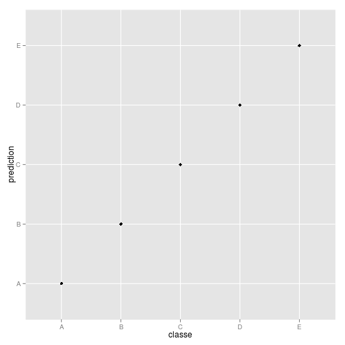

Practical Machine Learning
========================================================

This document describes the analysis.

## Data loading  

We import the requiered packages.


```r
library(caret)
```

```
## Loading required package: lattice
## Loading required package: ggplot2
```

```r
library(randomForest)
```

```
## randomForest 4.6-10
## Type rfNews() to see new features/changes/bug fixes.
```

```r
library(e1071)
```


Because the data is already divided into training and test sets, all we do is loading the proper files.


```r
trainingSet <- read.csv(file = "trainingSet.csv", header = TRUE)
testSet <- read.csv(file = "testSet.csv", header = TRUE)
```


## Preprocessing

Unused columns are removed from the data. In this case we considered that the first seven columns are not relevant for the prediction process and for this reason, they were removed from the data.


```r
trainingSet <- trainingSet[, -c(1:7)]
testSet <- testSet[, -c(1:7)]
```


Because some columns were loaded as factors, we make sure that everything is treated as a number (except for the last column, that corresponds to the expected output).


```r
for (i in 1:(ncol(trainingSet) - 1)) {
    trainingSet[, i] <- as.numeric(as.character(trainingSet[, i]))
}
```

```
## Warning: NAs introduced by coercion
## Warning: NAs introduced by coercion
## Warning: NAs introduced by coercion
## Warning: NAs introduced by coercion
## Warning: NAs introduced by coercion
## Warning: NAs introduced by coercion
## Warning: NAs introduced by coercion
## Warning: NAs introduced by coercion
## Warning: NAs introduced by coercion
## Warning: NAs introduced by coercion
## Warning: NAs introduced by coercion
## Warning: NAs introduced by coercion
## Warning: NAs introduced by coercion
## Warning: NAs introduced by coercion
## Warning: NAs introduced by coercion
## Warning: NAs introduced by coercion
## Warning: NAs introduced by coercion
## Warning: NAs introduced by coercion
## Warning: NAs introduced by coercion
## Warning: NAs introduced by coercion
## Warning: NAs introduced by coercion
## Warning: NAs introduced by coercion
## Warning: NAs introduced by coercion
## Warning: NAs introduced by coercion
## Warning: NAs introduced by coercion
## Warning: NAs introduced by coercion
## Warning: NAs introduced by coercion
## Warning: NAs introduced by coercion
## Warning: NAs introduced by coercion
## Warning: NAs introduced by coercion
## Warning: NAs introduced by coercion
## Warning: NAs introduced by coercion
## Warning: NAs introduced by coercion
```

```r
for (i in 1:(ncol(testSet) - 1)) {
    testSet[, i] <- as.numeric(as.character(testSet[, i]))
}
```


The data contains many NA's. We preprocess the data by removing the columns that contain at least one NA.


```r
trainingSet <- trainingSet[, colSums(is.na(trainingSet)) == 0]
testSet <- testSet[, colSums(is.na(testSet)) == 0]
```


At this moment we have a training set with 19622 examples, each example containing 52 features mapped to an expected output.

## Training of the prediction model

We trained a simple prediction model by using a random forest with 100 trees and all the available features (52) to predict the class of training (*classe*).


```r
randomForestModel <- randomForest(classe ~ ., data = trainingSet, ntree = 100, 
    importance = TRUE)
```


We provide a fast comparison between the prediction and the real output on the training set.


```r
prediction <- predict(randomForestModel, newdata = trainingSet)
qplot(classe, prediction, data = trainingSet)
```

 


Finally, we provide a more detailed view of the quality of the prediction by looking at the confussion matrix.


```r
confusionMatrix(prediction, trainingSet$classe)
```

```
## Confusion Matrix and Statistics
## 
##           Reference
## Prediction    A    B    C    D    E
##          A 5580    0    0    0    0
##          B    0 3797    0    0    0
##          C    0    0 3422    0    0
##          D    0    0    0 3216    0
##          E    0    0    0    0 3607
## 
## Overall Statistics
##                                 
##                Accuracy : 1     
##                  95% CI : (1, 1)
##     No Information Rate : 0.284 
##     P-Value [Acc > NIR] : <2e-16
##                                 
##                   Kappa : 1     
##  Mcnemar's Test P-Value : NA    
## 
## Statistics by Class:
## 
##                      Class: A Class: B Class: C Class: D Class: E
## Sensitivity             1.000    1.000    1.000    1.000    1.000
## Specificity             1.000    1.000    1.000    1.000    1.000
## Pos Pred Value          1.000    1.000    1.000    1.000    1.000
## Neg Pred Value          1.000    1.000    1.000    1.000    1.000
## Prevalence              0.284    0.194    0.174    0.164    0.184
## Detection Rate          0.284    0.194    0.174    0.164    0.184
## Detection Prevalence    0.284    0.194    0.174    0.164    0.184
## Balanced Accuracy       1.000    1.000    1.000    1.000    1.000
```


## Conclusions

We have observed that it is possible to predict the type of exercise by using only the following features:


```r
names(trainingSet[, -(dim(trainingSet[2]))])
```

```
##  [1] "pitch_belt"           "yaw_belt"             "total_accel_belt"    
##  [4] "gyros_belt_x"         "gyros_belt_y"         "gyros_belt_z"        
##  [7] "accel_belt_x"         "accel_belt_y"         "accel_belt_z"        
## [10] "magnet_belt_x"        "magnet_belt_y"        "magnet_belt_z"       
## [13] "roll_arm"             "pitch_arm"            "yaw_arm"             
## [16] "total_accel_arm"      "gyros_arm_x"          "gyros_arm_y"         
## [19] "gyros_arm_z"          "accel_arm_x"          "accel_arm_y"         
## [22] "accel_arm_z"          "magnet_arm_x"         "magnet_arm_y"        
## [25] "magnet_arm_z"         "roll_dumbbell"        "pitch_dumbbell"      
## [28] "yaw_dumbbell"         "total_accel_dumbbell" "gyros_dumbbell_x"    
## [31] "gyros_dumbbell_y"     "gyros_dumbbell_z"     "accel_dumbbell_x"    
## [34] "accel_dumbbell_y"     "accel_dumbbell_z"     "magnet_dumbbell_x"   
## [37] "magnet_dumbbell_y"    "magnet_dumbbell_z"    "roll_forearm"        
## [40] "pitch_forearm"        "yaw_forearm"          "total_accel_forearm" 
## [43] "gyros_forearm_x"      "gyros_forearm_y"      "gyros_forearm_z"     
## [46] "accel_forearm_x"      "accel_forearm_y"      "accel_forearm_z"     
## [49] "magnet_forearm_x"     "magnet_forearm_y"     "magnet_forearm_z"    
## [52] "classe"
```


As part of the project, we are required to submit the prediction of the 20 instances in the training set. This is conducted by using the code provided by the instructors in the site of the course. 


```r
pml_write_files = function(x) {
    n = length(x)
    for (i in 1:n) {
        filename = paste0("Test results/problem_id_", i, ".txt")
        write.table(x[i], file = filename, quote = FALSE, row.names = FALSE, 
            col.names = FALSE)
    }
}
answers <- predict(randomForestModel, newdata = testSet)
answers
```

```
##  1  2  3  4  5  6  7  8  9 10 11 12 13 14 15 16 17 18 19 20 
##  B  A  B  A  A  E  D  B  A  A  B  C  B  A  E  E  A  B  B  B 
## Levels: A B C D E
```

```r

pml_write_files(answers)
```

